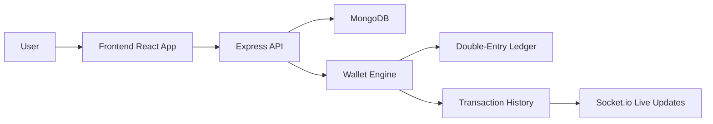

# YugCoin

YugCoin is a digital wallet platform built to make money movement more transparent, secure, and easier to understand. It combines a modern wallet interface with a real double-entry ledger system so every transaction is tracked, validated, and auditable.

This project was designed for visitors, learners, and contributors who want to explore how a real-world wallet system can be structured with React, Node.js, Express, MongoDB, and live socket-based updates.

## Live Demo

Visit the live application here:

- https://yugcoin-frontend.onrender.com

## Project Team

- Developer: https://github.com/drj7zz
- Developer: https://github.com/coder-khushi
- Support / Project Inquiry: giridirghraj@gmail.com

## Why YugCoin?

At its core, YugCoin is more than just a wallet UI. It is a learning-focused financial application that demonstrates:

- wallet creation and management
- secure transfers between accounts
- deposit and withdrawal flows
- ledger integrity checks
- live transaction updates
- data-backed financial transparency

The app is built to feel real, practical, and educational for anyone interested in blockchain-like ledger systems, secure financial software, or full-stack development.

## Key Features

### Wallet Experience

- user authentication and wallet registration
- wallet balance tracking in YUG currency
- transfer workflow between valid wallet addresses
- deposit and withdrawal controls
- responsive dashboard for overview and history

### Financial Integrity

- double-entry ledger model
- debit and credit entries recorded for every movement
- cryptographic hash chaining for auditability
- ledger verification checks to detect discrepancies

### Real-Time Interaction

- live activity updates using Socket.io
- instant UI refresh after wallet changes
- transaction event notifications in real time

### Contributor-Friendly Design

- clean backend and frontend separation
- modular architecture for learning and extension
- easy-to-follow folder structure
- production-ready deployment patterns

## Visual Overview



## Tech Stack

### Frontend

- React
- JavaScript / JSX
- Socket.io client
- Responsive UI components

### Backend

- Node.js
- Express.js
- MongoDB with Mongoose
- JWT authentication
- rate limiting for API protection

### Financial Layer

- wallet engine service
- transaction processing logic
- ledger verification and integrity checks

## Project Structure

```text
yugcoin/
├── backend/
│   ├── src/
│   │   ├── admin/
│   │   ├── config/
│   │   ├── controllers/
│   │   ├── middleware/
│   │   ├── models/
│   │   ├── routes/
│   │   ├── services/
│   │   ├── utils/
│   │   ├── server.js
│   │   └── seed.js
│   ├── test/
│   └── package.json
├── frontend/
│   ├── public/
│   ├── src/
│   └── package.json
├── package.json
├── README.md
└── .env.example (if configured in your environment)
```

## How It Works

1. A user signs in or creates an account.
2. A wallet is created and linked to the user profile.
3. Transfers or deposits trigger the wallet engine.
4. The backend validates account balances and transaction rules.
5. A MongoDB transaction records the movement.
6. Ledger entries are written for both debit and credit sides.
7. The frontend receives real-time updates and refreshes the wallet state.

This creates a transaction trail that is not only useful for the UI, but also trustworthy from a financial logic point of view.

## Local Setup

### Prerequisites

- Node.js 18 or newer
- MongoDB Atlas or a local MongoDB instance
- npm

### Backend Setup

1. Open the backend folder.
2. Create your environment file with the required values.
3. Add your MongoDB URI and JWT secret.

Example environment values:

```env
MONGO_URI=mongodb+srv://<username>:<password>@<cluster>.mongodb.net/?appName=yugcoin
JWT_SECRET=your_super_secret_key
PORT=5000
```

Then run:

```bash
cd backend
npm install
npm start
```

### Frontend Setup

```bash
cd frontend
npm install
npm start
```

The frontend connects to the backend API and can also display live wallet updates with the configured socket connection.

## Production Build

To create a frontend production build:

```bash
cd frontend
npm run build
```

This prepares the project for deployment and static hosting environments.

## Contribution Guide

We welcome contributions from students, developers, and curious learners.

### Ways to contribute

- improve the UI and UX
- fix bugs or edge cases in wallet logic
- strengthen ledger validation and security
- add documentation and examples
- improve tests and production reliability
- suggest features for better finance workflows

### Good contribution workflow

1. Fork the repository or clone it locally.
2. Create a feature branch for your work.
3. Keep changes focused and well-documented.
4. Test the relevant functionality before submitting.
5. Open a clear pull request with a summary of what changed and why.

### Suggested learning paths

- Frontend: start with the React components in the frontend folder.
- Backend: study the Express routes and the wallet engine service.
- Database: inspect the Mongoose models and ledger structure.
- Transactions: understand how debits, credits, and wallet balance checks work together.

## Learning Value

YugCoin is an excellent project for learning because it combines several real-world engineering concepts:

- API design
- authentication and authorization
- database transactions
- financial invariants
- real-time updates
- auditability and reporting
- full-stack integration

Whether you are learning software engineering or exploring financial product design, this project gives a practical foundation.

## Support and Contact

If you want to ask questions, collaborate, or seek help regarding this project, please reach out:

- Email: giridirghraj@gmail.com
- GitHub: https://github.com/drj7zz
- GitHub: https://github.com/coder-khushi

We are happy to welcome learners, collaborators, and developers who want to explore the project further.

## Project Vision

YugCoin aims to show how a thoughtful wallet application can combine usability, financial rules, and technical reliability into one experience. The intention is not only to build an app, but to create a clear, understandable, and practical example of how digital financial systems are designed.

## Final Note

If you are visiting this repository, thank you for taking the time to explore it. Whether you are here to learn, contribute, or simply understand the project, YugCoin is built to be approachable, educational, and professional.

We hope this project inspires curiosity, technical learning, and meaningful contributions.
