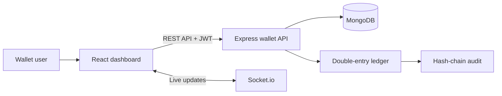
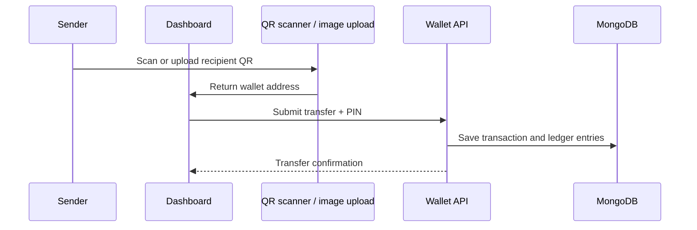

# YugCoin Wallet

> A learning-focused digital-wallet dashboard for exploring wallet balances, transfers, transaction history, QR payments, and double-entry ledger concepts.


## About YugCoin

YugCoin is an educational wallet application. It helps learners understand the building blocks of a digital wallet: account access, YUG balances, simulated deposits and transfers, transaction records, QR wallet addresses, and ledger integrity checks.

> **Learning project only:** YUG is not a real currency. YugCoin does not process real payments and must not be used to store or transfer real funds.

## Features

- Email/password and Google registration and sign-in
- Password strength validation, confirmation, and an account-email disclaimer
- Personal YUG wallet balance dashboard
- Fixed initial demo balance and wallet-to-wallet transfers
- Permanent usernames for receiving payments without sharing wallet IDs
- Mandatory payment note/reference, transfer PIN confirmation, and idempotency protection
- Live transaction activity with Socket.io updates
- YugCoin QR payment profiles carrying the recipient handle, name, and wallet UID
- Camera QR scanner for recipient wallet addresses
- QR-image upload scanner for PNG, JPG, and WebP images
- Closable transaction statements with JPEG export
- Immediate post-payment receipt preview with JPEG download and redo-payment action
- Transaction history and statements showing the counterparty name, username, and wallet ID
- Profile page with secure password and transfer-PIN changes
- Coupon redemption interface ready for backend validation; self top-ups are disabled
- Cryptographic hash-chain ledger audit endpoint
- Responsive dashboard for desktop and mobile

## Architecture



### QR payment flow



## Technology

| Layer | Technology |
| --- | --- |
| Frontend | React 18, Create React App, CSS, Lucide icons |
| QR features | `qrcode.react`, camera API, native `BarcodeDetector` |
| Backend | Node.js, Express, Socket.io |
| Data | MongoDB with Mongoose |
| Security | JWT, bcrypt, transfer PIN verification, idempotency keys |

## Project structure

```text
yugcoin/
├── backend/
│   ├── src/
│   │   ├── admin/                 # Administrative routes
│   │   ├── config/                # Database configuration
│   │   ├── controllers/           # Auth and wallet controllers
│   │   ├── middleware/            # JWT middleware
│   │   ├── models/                # User, wallet, transaction, ledger models
│   │   ├── routes/                # API routes
│   │   ├── services/              # Wallet and double-entry ledger engine
│   │   ├── seed.js
│   │   └── server.js
│   └── test/
├── frontend/
│   ├── public/
│   └── src/
│       ├── assets/
│       ├── components/
│       │   ├── AuthModal.jsx
│       │   ├── Dashboard.jsx
│       │   ├── DepositWithdrawModal.jsx
│       │   ├── InsightsView.jsx
│       │   ├── Navbar.jsx
│       │   ├── TransferModal.jsx
│       │   └── WalletQrScanner.jsx # Camera and uploaded-image scanner
│       ├── services/api.js
│       ├── App.jsx
│       └── index.css
├── .gitignore
├── package.json
└── README.md
```

## Run locally

### Prerequisites

- Node.js 18 or newer
- npm
- A MongoDB database (local MongoDB or MongoDB Atlas)

### 1. Configure the backend

Create `backend/.env`:

```env
MONGO_URI=mongodb+srv://<username>:<password>@<cluster>/<database>
JWT_SECRET=replace-with-a-long-random-secret
GOOGLE_CLIENT_ID=your-google-oauth-web-client-id.apps.googleusercontent.com
PORT=5000
```

Install and run the API:

```bash
cd backend
npm install
npm start
```

### 2. Run the frontend

In a separate terminal:

```bash
cd frontend
npm install
```

Create `frontend/.env` with the matching Google OAuth web client ID:

```env
REACT_APP_GOOGLE_CLIENT_ID=your-google-oauth-web-client-id.apps.googleusercontent.com
REACT_APP_API_URL=http://localhost:5000/api
REACT_APP_SOCKET_URL=http://localhost:5000
```

In Google Cloud Console, add your frontend URL (for example `http://localhost:3000`) to the OAuth client's authorized JavaScript origins.

Set the local API URL in PowerShell, then start React:

```powershell
$env:REACT_APP_API_URL = 'http://localhost:5000/api'
npm start
```

The dashboard opens at `http://localhost:3000`.

## QR scanner notes

The QR scanner uses the browser's native `BarcodeDetector` API and requires camera permission for live scanning. If camera scanning is unavailable or permission is declined, manual wallet-ID or username entry remains available. Uploaded QR images are read locally in the browser.

## Product roadmap

### v1.0 — Wallet foundations

- Secure wallet accounts, demo YUG balances, transfers, and a transparent double-entry ledger.

### v1.1 — Payments and account tools

- Receive YUG with a permanent username or YugCoin QR payment profile.
- Keep a username, name, and wallet ID visible in transfer history and statements.
- Manage password and transfer PIN securely from the Profile page.
- Limit balances to the initial demo allocation until backend-validated coupons are available.

### v1.2.0 — Current release

- Add Google sign-in and signup with server-side credential verification.
- Add strong password requirements, password confirmation, and official-email/username guidance.
- Fix browser Back behavior so open popups close before navigation continues.
- Separate send and receive contexts in transaction statements to clearly identify the sender and recipient.
- Export complete YugCoin-themed JPEG statements and improve responsive mobile UI behavior.

### Upcoming

- Add backend-validated coupon rewards and reusable payment requests.
- Introduce a contributor quest board for community learning tasks and rewards.
- Build the YUG marketplace on top of the controlled demo economy.

- Improve the database structure for users, wallets, transactions, rewards, coupons, and marketplace orders.
- Fix transaction statements with complete payment details, statuses, and download options.
- Create an Account page for profile settings, password changes, PIN changes, and security controls.
- Add KYC-style verification to improve account security and trust.
- Improve the dashboard with better visuals, images, charts, and wallet insights.
- Build a controlled balance-flow system with fixed or limited demo YUG amounts.
- Add payment requests through QR codes and usernames.
- Create a Coupons and Rewards page where users can earn and redeem YUG rewards.
- Build a YugCoin marketplace where users can spend YUG on demo or digital products.
- Add an internal YUG economy through transfers, rewards, coupons, and marketplace payments.
- Make YugCoin open source with professional documentation, contribution rules, and a public roadmap.
- Launch YugCoin as a web app first and later develop it as a mobile application.

## API overview

| Method | Endpoint | Purpose |
| --- | --- | --- |
| `POST` | `/api/auth/register` | Create a learning wallet account |
| `POST` | `/api/auth/login` | Sign in and receive a JWT |
| `POST` | `/api/auth/google` | Verify a Google credential and sign in or create a wallet |
| `GET` | `/api/auth/me` | Get the current user and wallets |
| `GET` | `/api/wallet/balances` | Get wallet balances |
| `POST` | `/api/wallet/deposit` | Simulate a YUG deposit |
| `POST` | `/api/wallet/transfer` | Send simulated YUG to another wallet |
| `GET` | `/api/wallet/history` | Get wallet transaction history |
| `GET` | `/api/wallet/audit` | Verify ledger hash-chain integrity |
| `GET` | `/api/health` | Check API status |

## Build and verification

Build the frontend production bundle:

```bash
cd frontend
npm run build
```

Run backend tests:

```bash
cd backend
npm test
```

> The current backend test suite still targets a retired in-memory wallet-engine API. Update it to use an isolated MongoDB test database before relying on it in CI.

## Live app

https://yugcoin-frontend.onrender.com

## Team

- GitHub: [drj7zz](https://github.com/drj7zz)
- GitHub: [coder-khushi](https://github.com/coder-khushi)
- Contact: giridirghraj@gmail.com
